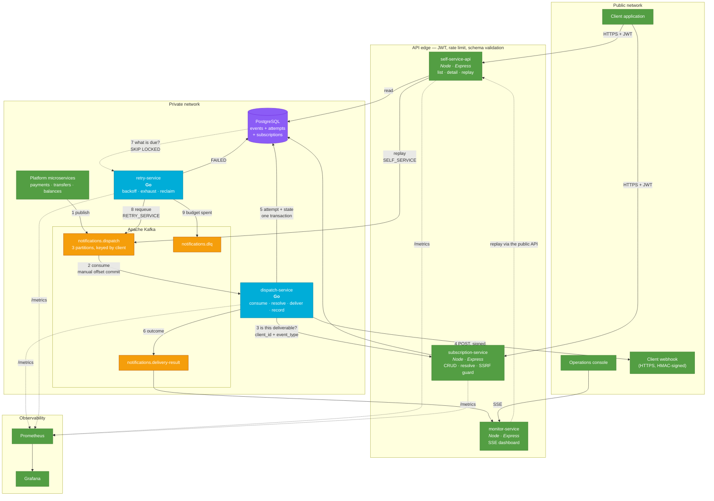

# System architecture

Everything in this diagram exists and runs. Nothing is aspirational.

## The three properties worth defending

**One delivery pipeline.** A first delivery (1→2), an automatic retry (8→2) and
a client replay (self-service→2) all enter through the same topic and run the
same code. They differ only in `dispatch_source`, which exists so the audit
trail can tell them apart. There is no second implementation of delivery that
could drift from the first.

**The producer knows nothing.** `platform` publishes an event. It does not know
webhooks exist, which clients are subscribed, or whether a delivery failed. Add
a delivery channel tomorrow and no producer changes.

**Observability is a consumer.** `monitor-service` subscribes to `t2`. It holds
no database connection and nothing in the delivery path references it. Remove
it and delivery is unaffected.

## Where the boundaries are

| Boundary | Enforced by |
|---|---|
| Client ↔ platform | JWT at the edge; `client_id` from the token, never the request |
| Notifications ↔ Subscriptions | HTTP call on `(client_id, event_type)` — two bounded contexts |
| Platform ↔ client endpoint | SSRF guard, HMAC signature, no redirects, egress timeout |
| Delivery ↔ retry policy | dispatch answers *did it work*; retry answers *try again?* |
| Delivery ↔ observability | a Kafka topic, one-way |
