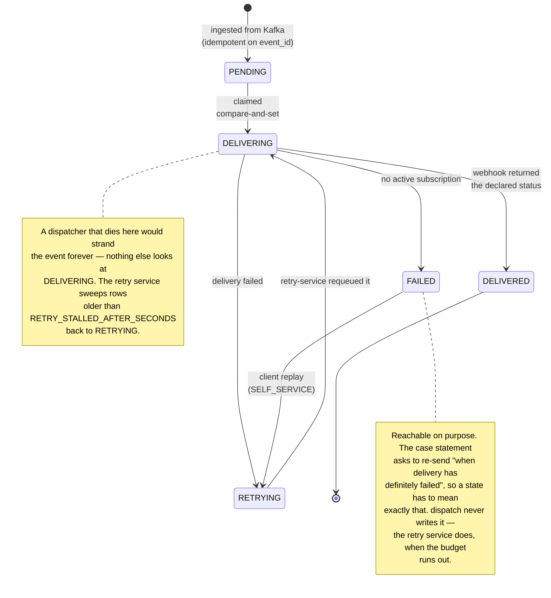

# The delivery lifecycle

One state machine, defended in one place:
`services/dispatch-service/internal/domain/notification_event.go`.



## Why the transitions are a table, not a set of `if`s

```go
var allowedTransitions = map[EventState][]EventState{
	StatePending:    {StateDelivering},
	StateDelivering: {StateDelivered, StateRetrying, StateFailed},
	StateRetrying:   {StateDelivering},
	StateDelivered:  {},              // terminal
	StateFailed:     {StateRetrying}, // a replay re-opens it
}
```

Every legal and illegal edge is asserted in
`notification_event_test.go`, so widening the machine is a deliberate act that
shows up in a diff, not an emergent property of scattered conditionals.

## The two defects this shape fixes

The previous implementation had `FAILED` unreachable: a failed delivery went
back to `PENDING`, so nothing ever declared an event definitively failed. The
replay endpoint then guarded on the wrong states — it rejected `FAILED` and
accepted `PENDING`. Both bugs were invisible because they were consistent with
each other.

Making the transition table explicit is what makes that class of error a
compile-and-test failure instead of a silent behaviour.
