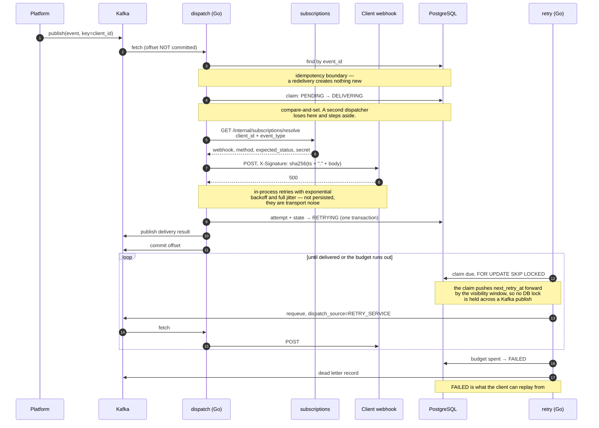

# Sequences

## Delivery, including failure and recovery



## Replay, requested by the client

```mermaid
sequenceDiagram
  autonumber
  participant C as Client
  participant A as self-service-api
  participant DB as PostgreSQL
  participant K as Kafka
  participant D as dispatch (Go)
  participant W as Client webhook

  C->>A: POST /notification_events/{id}/replay<br/>Authorization: Bearer …

  A->>A: client_id from the token claim
  Note over A: never from the query string or body —<br/>that was the cross-tenant read

  A->>DB: find by (id, client_id)
  Note over A,DB: ownership is part of the lookup,<br/>so it cannot be forgotten at a call site
  DB-->>A: event, state = FAILED

  A->>A: canBeReplayed() — FAILED only
  Note over A: 409 with an explanation for any<br/>other state; 404 for another client's id

  A->>DB: FAILED → RETRYING
  A->>K: publish original payload<br/>dispatch_source=SELF_SERVICE
  A-->>C: 202 { state: "RETRYING" }

  K->>D: the same consumer, the same code
  D->>W: POST, signed
  W-->>D: 200
  D->>DB: attempt 6 · SELF_SERVICE · SUCCESS<br/>state = DELIVERED
```

The audit trail after that sequence, taken from a real run:

| attempt | dispatch_source | status |
|---|---|---|
| 1 | `SYSTEM` | FAILED |
| 2 | `RETRY_SERVICE` | FAILED |
| 3 | `RETRY_SERVICE` | FAILED |
| 4 | `RETRY_SERVICE` | FAILED |
| 5 | `RETRY_SERVICE` | FAILED |
| 6 | `SELF_SERVICE` | SUCCESS |

Six rows, three origins, one pipeline. That table is the architecture.
