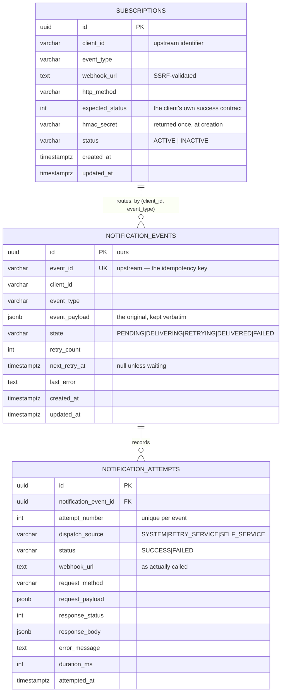

# Data model

## Why event and attempt are separate

The event holds *what the platform said*. The attempt holds *what we did about
it*. Collapsing them would mean either losing the original payload on the first
retry, or duplicating it on every attempt.

Keeping the payload on the event is what makes a replay months later send
exactly what the platform originally produced, rather than a reconstruction.

## Identifiers

`id` is ours: a UUID we generate. `event_id` and `client_id` come from upstream
systems, so they are stored as opaque indexed strings.

That is not a concession — it is the more honest model. We do not control the
format of another system's identifiers, and pretending otherwise means either
rejecting valid input or rewriting it. It is also why the case statement's own
fixture (`EVT001`, `CLIENT001`) loads verbatim, with no mapping trick to explain.

## The constraints that carry weight

| Constraint | What it prevents |
|---|---|
| `UNIQUE (event_id)` | the same upstream event ingested twice — idempotency enforced by the database, not by a read-then-write check |
| `UNIQUE (client_id, event_type)` on subscriptions | ambiguous resolution; makes the dispatcher's lookup deterministic |
| `UNIQUE (notification_event_id, attempt_number)` | a gapped or duplicated attempt sequence under concurrent writers |
| `CHECK` on `state`, `status`, `dispatch_source` | an unknown value reaching the table from any writer, in any language |
| `FK … ON DELETE CASCADE` | orphaned attempts |

## The indexes and the query each one serves

| Index | Query |
|---|---|
| `(client_id, created_at DESC)` | the self-service list, always client-scoped and newest-first |
| `(client_id, state)` | filtering by `delivery_status` within a client |
| `(next_retry_at) WHERE state = 'RETRYING'` | the retry poller — partial, so it scans only rows actually waiting |
| `(notification_event_id, attempt_number)` | the detail endpoint's attempt history |

## Two pieces of concurrency control

**`ClaimForDelivery`** is a compare-and-set on `state`. Two dispatchers can read
the same `PENDING` event, but only one `UPDATE` matches, and only that one calls
the webhook. This is what stops at-least-once *consumption* from becoming
at-least-once *delivery*.

**Attempt numbering** is serialised by a `SELECT … FOR UPDATE` on the parent
event row inside the same transaction that writes the attempt. An earlier
version used an optimistic retry loop; an integration test with fifteen
concurrent writers lost six of them, which is how the row lock got there.
